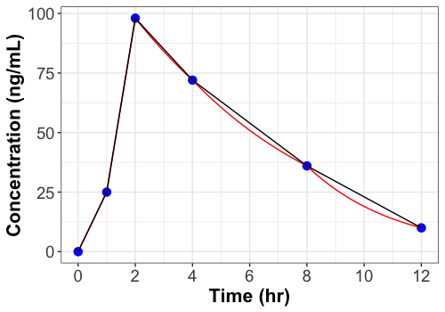

# 🟦 Area Under the Curve
The area under the curve (AUC) is a measure of the total drug exposure over a specific period of time. It is calculated by determining the area under the concentration-time curve. The total area is calculated by first determining the area under the curve for two consecutive time points with concentration values. These are called partial areas under the curve ($pAUC$). The sum of all of the individual $pAUCs$ values gives the total AUC. 

## Aplos NCA Approach
Aplos NCA employs two separate methods for calculating the $pAUC$ values. The first is the [linear trapezoidal method](#linear-method). In this method the line between the two concentration values follows a linear path. The second method is called the [linear up logarithmic down method](#linear-up-logarithmic-down-method). In this method, the linear method is used whenever concentrations are increasing, and a logarithmic calculation is used when concentrations are decreasing. For the logarithmic calculation, the line between the two concentrations follows a logarithmic decline. In the figure below, the linear method is depicted with the black line and the linear up logarithmic down method is shown with the red line. 

The logarithmic method generally gives a slightly smaller $pAUC$ than the linear method because the logarithmic decline between two concentration values is convex compared to the linear decline. The logarithmic method is thought to more closely approximate the log-linear decline observed for most drug concentrations compared to the linear method. In practice, the differences between the two methods when comparing total AUC for a full PK profile with multiple samples is very small.

## Linear Method

The following equation is used to calculate the $pAUC$ between any two data points with concentration values:

$pAUC={{1} \over {2}} *(C2 + C1) * (T2 - T1)$

## Linear Up Logarithmic Down Method

The following equation is used to calculate the $pAUC$ for any two data points with concentration values which are increasing, or when either concentration value is 0:

$$ pAUC={{1} \over {2}} *(C2 + C1) * (T2 - T1) $$

When the concentrations are declining, and neither concentration value is 0, the following equation is used to calculate the $$ pAUC $$:

$$ pAUC = [{{C1 - C2} \over {ln({{C1} \over {C2}})}}]*(T2 - T1) $$
