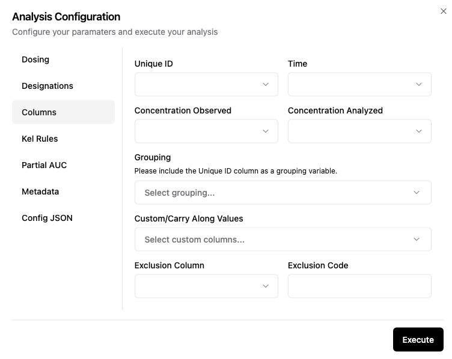

# 🔵 Data Columns Configuration

A description of each setting on the Data Columns configuration screen is below:

|Field name|Description|Required?|
|:---|:---|:---|
|Time|Sample time for analysis|Required|
|Unique ID|Unique identifier for each subject or animal. If there are multiple profiles for a single subject (e.g. mutliple formulations), use the Grouping variables also.|Required|
|Concentration Observed|Observed concentration that includes text designations for samples below the limit of quantitation or missing samples|Required|
|Concentration Analyzed|Concentration to be used in the calculation of PK parameters. Imputations for missing samples and/or samples below the limit of quantation must be made in this column|Required|
|Grouping variables|Any grouping variables needed to define unique PK profiles for analysis|1 column is required, additional columns are optional|
|Sorting|This is how the data is sorted prior to analysis for each unique profile. Generally include the time column variable|1 column is required, additional columns are optional|
|Custom/Carry Along Values|These are columns with information that will be added to the output files, but is not used group grouping.|Optional|

**Figure 1: Columns configuration input screen**

## 
> [!TIP]
> The column headers are imported from the analysis dataset and available from the dropdown lists. You can select multiple values for Grouping, Sorting, and Custom/Carry Along Values. You can de-select those using the dropdown list also. 
>
> The column selected for Time will automatically be populated in the Sorting dropdown. The column selected for Unique ID will automatically be populated in the Grouping dropdown.
