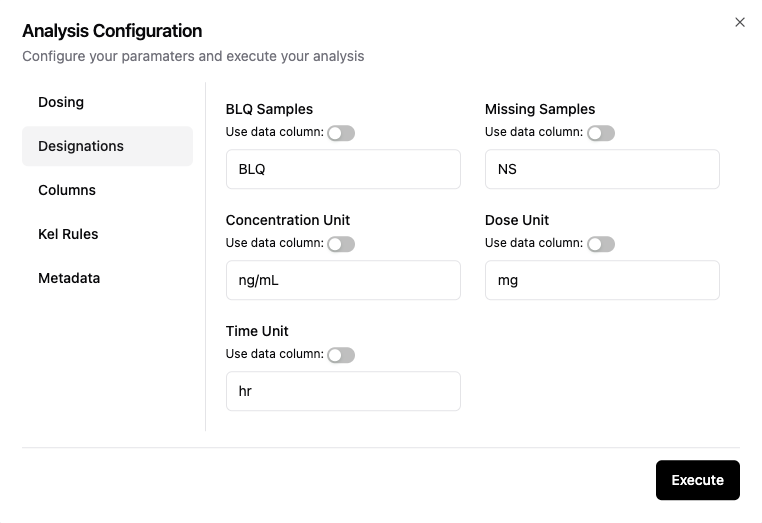

# 🟠 Designations Configuration
A description of each setting on the Designations configuration screen (Figure 1) is below. All of these designations can be set globally for all profiles in the dataset, or individually for each unique profile using a data column.

|Field name|Description|
|:---|:---|
|BLQ Samples|Text designation for samples below the limit of quantitation in the Observed Concentration column|
|Missing Samples|Text designation for missing samples in the Observed Concentration column|
|Concentration unit|Text string for units associated with Analyzed Concentration column|
|Dose unit|Text string for units associated with the Dose Amount|
|Time unit|Text string for units associated with the Time column|

**Figure 1: Designation configuration input screen**

## 
> [!WARNING]
> The text designations for BLQ and Missing Samples require an exact match for the sample to be counted as either BLQ or Missing. Only a single text value can be used in these fields. Be aware that your results may not be as expected in the following situations:
>
> BLQ values are recorded as "BLQ (<0.10)" and "BLQ (<0.15)" because 2 different assays were used. 
> -   To properly count BLQ samples, it is recommended that you create a separate column with "BLQ" as the value.
>
> Missing samples are recorded as "NS" (no sample), "ND" (not done), or "Missing" because there are different reasons for missing samples. 
> -   To properly count Missing samples, it is recommended that you create a separate column with "Missing" as the value.
