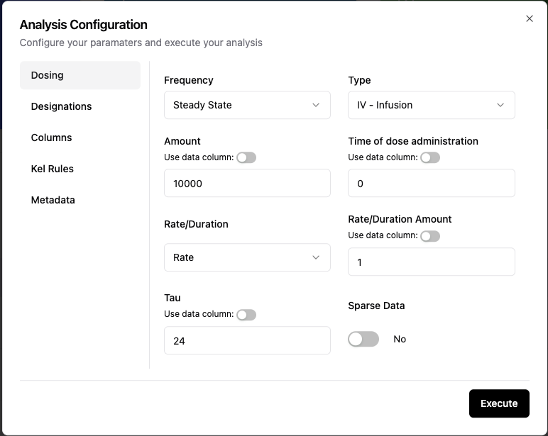

# 💊 Dosing Configuration

A description of each setting on the Dosing configuration screen (Figure 1) is below:

|Field name|Options or Input|Can be a data column?|Description|
|:---|:---|:---:|:---|
|Frequency|Single Dose, Steady State|No|Single dose is used after a single dose. Steady state is used after mutliple doses of the drug using a constant dosing interval|
|Type|Extravascular, IV Bolus, IV Infusion|No|Route of administration of the drug. Extravascular includes all routes that are not intravenous (IV)|
|Amount|Dose amount in decimal format|Yes|Amount of dose for all subjects in the dataset (if entered) or value in first record of selected column for each unique profile|
|Time of dose administration|Time of dose administration in decimal format|Yes|Time of dose administration for all subjects in the dataset (if entered) or value in first record of selected colum for each unique profile|
|Rate or Duration|Rate, Duration|No|This appears only if the Route is IV Infusion|
|Rate/Duration Amount|Rate or Duration of Infusion in decimal format|Yes|This only appears if the Route is IV Infusion. Value for rate or duration for all subjects in the dataset (if entered) or value in first record of selected column for each unique profile|
|Tau|Dosing interval in decimal format|Yes|This only appears if the Frequency is Steady State. Value for tau for all subjects in the dataset (if entered) or value in first record of selected column for each unique profile|
|Sparse Data|Yes or No|No|Default is "No" if each individual animal or subject provides a complete profile. Set to "Yes" if you want to calculate a mean concentration-time profile using grouping variables. Normally used in toxicology studies with small animals.|

**Figure 1: Dosing configuration input screen**

## 
> [!TIP]
> Examples when you may want to use a data column for the dose amount:
>  - Dose escalation study
>  - Toxicokinetic study with multiple dose groups
> 
> Only the value in the first record of each profile will be used when you select a data column.