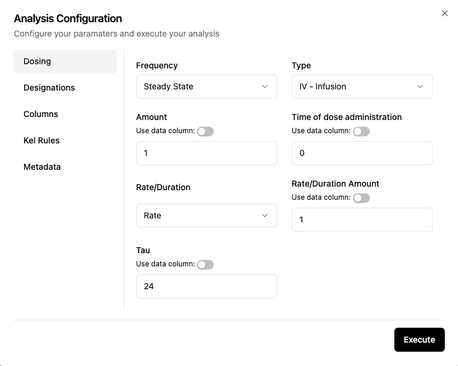

# 💊 Dosing Configuration

A description of each setting on the Dosing configuration screen (Figure 1) is below:

|Field name|Options or Input|Description|
|:---|:---|:---|
|Frequency|Single Dose, Steady State|Single dose is used after a single dose. Steady state is used after mutliple doses of the drug using a constant dosing interval|
|Type|Extravascular, IV Bolus, IV Infusion|Route of administration of the drug. Extravascular includes all routes that are not intravenous (IV)|
|Amount|Dose amount in decimal format|Amount of dose for all subjects in the dataset|
|Unit|text string|Units of administered dose|

**Figure 1: Dosing configuration input screen**

