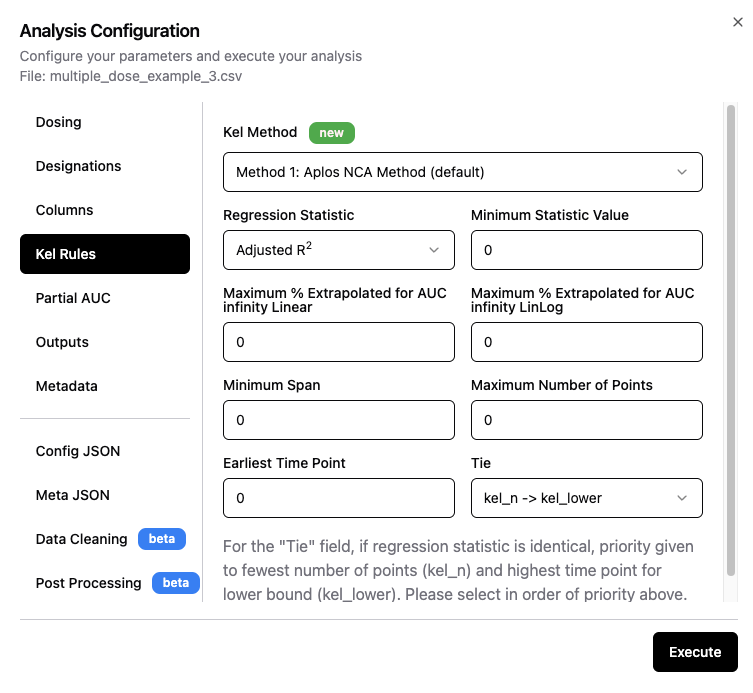

# 🟢 Kel Configuration

On this screen (Figure 1) the user sets the rules by which the best-fit terminal elimination rate constant is selected by Aplos NCA. 

**Figure 1: Kel rules configuration screen**

The best-fit rate constant must meet all of the criteria specified. If multiple rate constants fit the criteria, the one with the largest statistic value (either r2 or adjusted r2) will be selected. If two or more rate constants have the same statistic value, then the tie-breaker rules are used. A description of each setting on the Kel configuration screen is below:

## Description of input fields
|Field name|Description|
|:---|:---|
|Regression statistic|Choose either r2 or adjusted r2. The default is [adjusted r2](#adjusted-r2-calculation) as it gives a small penalty for each additional time point included in the regression.|
|Minimum statistic value|The chosen statistic must be greater than this value. Default is 0, meaning it is not used. Number must be less than 1.|
|Maximum % extrapolated for AUCinfinity Linear|The % extrapolated for the AUCinfinity calculated using the linear method must be less than this value. Default is 0, meaning it is not used. Number must be greater than 0 and less than 100.|
|Maximum % extrapolated for AUCinfinity LinLog|The % extrapolated for the AUCinfinity calculated using the linear up log down method must be less than this value. Default is 0, meaning it is not used. Number must be greater than 0 and less than 100.|
|Minimum Span|Minimum value for the Span variable. Default is 0, meaning it is not used. Any values greater than 0 are accepted.|
|Maximum number of points|Maximum number of time points permitted in the regression. Default is 0, meaning it is not used. Any values greater than 0 are accepted. Note that all regressions have a minimum of 3 data points.|
|Earliest time point|Earliest time point included in the regression. Default is 0, meaning it is not used.|
|Tie|Used if 2 regressions have identical values for the statistic. Default first tie-breaker is fewest number of data points. Default second tie-breaker is the latest time for the starting time point in the regression. User can switch the order of these tie-breakers.|

## Adjusted r2 Calculation
The adjusted r2 is calculated using the r2 from the regression and the number of data points included in the regresssion (n):
::: info Equation
$\text{Adjusted }r^2 = 1 - (1 - r^2)*\frac{n-1}{n-2}$
:::
The fraction $\frac{n-1}{n-2}$ will always be slightly larger than 1, thus the adjusted r2 will always be slightly smaller than r2. And as n gets larger, the effect becomes greater. This means that regressions with smaller number of points are preferred over ones with many points.