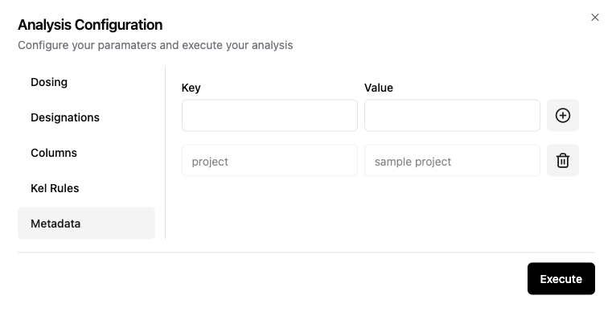

# Meta Data
Meta data can be attached to any analysis by the user and is searchable to permit quick identification of analyses of interest. All meta data is user-defined and there is no limit to the number or complexity of meta data descriptions. Meta data must be added at the time of analysis and cannot be updated later.

## Input for web configuration


Enter a value for the key and value and click the Add button. You can click the Remove button to remove a key:value pair you entered.

## Structure
Meta data is added using key:value pairs. If you are using the web-based configuration tool, you can enter the key and value and click the Add button. If you are using a formatted JSON file, you can follow the example below:

```js
{
  "compound": "IX-123",
  "study": "CL-123-004",
  "project": "psoriasis",
  "type-of-analysis": "interim-analysis"
}
```
In the example, there are 4 keys: "compound", "study", "project", and "type-of-analysis". The values after the colon : are the values assigned to those keys. 

::: danger
Do not use spaces in either the keys or the values. Spaces create challenges when searching for information from the database in the future. We recommend using a dash (-) instead of a space.
:::

## Recommendations
It is recommended that you attept to standardize on both the keys and values across your organization for the greatest benefit. However, it is impossible to predict every bit of information that might be needed in the future. We recommend development of a key:value guide for users and the preparation of a standard meta data json file that is readily available for all users. Since these values are stored as text, you may need to employ creative searching algorithms to capture inconsistent formatting across multiple users (e.g. IX-123 and IX123 may be used by different individuals)


