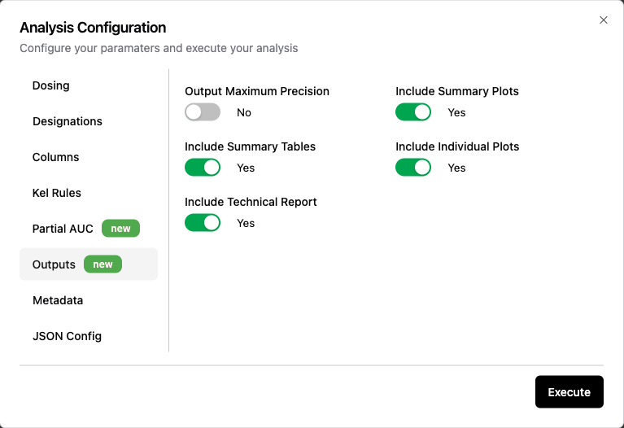

# 🟡 Outputs

Users can configure the outputs created by Aplos NCA using these selector sliders. The default settings are shown in the image, but the user can turn any of the options on or off as desired. 

|Option|Default|Description|
|:---|:---:|:---|
|Output Maximum Precision|No|Results in the pk-listing.csv file are rounded to the same significant figures as the largest concentration value in the input dataset. If full precision is required, change to "Yes" and no rounding will occur and the maximum precision available will be used for all parameters.|
|Include Summary Plots|Yes|Summary plots for each grouping variable will be prepared. If set to "No", summary plots will not be produced.|
|Include Summary Tables|Yes|Summary tables for each grouping variable will be prepared. If set to "No", summary tables will not be produced.|
|Include Individual Plots|Yes|Individual plots for each unique profile will be prepared. If set to "No", individual plots will not be produced.|
|Include Technical Report|Yes|Technical report will be prepared. If set to "No", the technical report will not be produced. Note the technical report includes summary plots, summary tables, and individual plots. If the technical report is set to "Yes", but the other items are set to "No", those items will not be included in the technical report.|

## 
> [!TIP]
> If you don't need something, turn set it to No and Aplos NCA will complete the analysis more quickly. This is particularly useful if you generate your own tables and figures using another software (like R or SAS). 

