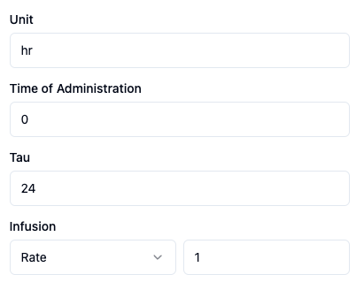

# Time Configuration

A description of each setting on the Time configuration screen is below:

|Field name|Options or Input|Description|
|:---|:---|:---|
|Unit|text string|Units associated with Time column|
|Time of administration|Time of dose administration in decimal format| Time of administration of dose for all subjects. Should be in the same units as the Time column from the analysis dataset|
|Tau|Dosing interval in decimal format|This only appears if the Frequency is Steady state|
|Rate or Duration|Rate, Duration|This appears only if the Route is IV Infusion|
|Amount|Rate or Duration of Infusion in decimal format| This only appears if the Route is IV Infusion|
