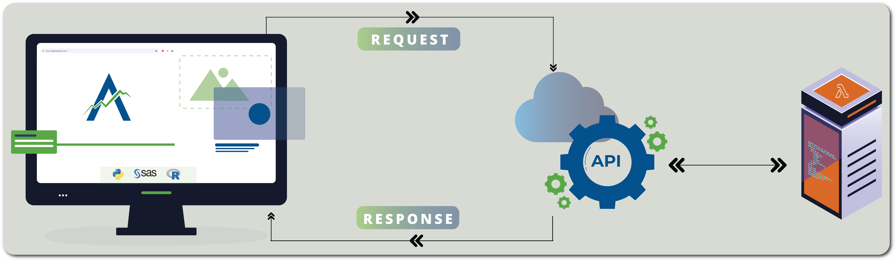

# 📎 How it works
The Aplos NCA API works using a series of requests and responses. Each request requires specific information and then the responses from the API can be used by the user. Full documentation of all API technical details is in the [API Reference documentation](/docs/api/). The following 4 requests and the responses from the Aplos NCA API are used for the analysis of data. Additional API calls are available to perform a variety of tasks like listing uploaded input datasets, listing analyses performed, or updating user information. 

## Authentication
All Aplos NCA API calls are gated, meaning that they require authentication before any action is taken. Authentication is discussed in detail [here](./security). Briefly, users must authenticate using Amazon Cognito after which they will receive a JSON web token or JWT. This is a authentication token that can be used for a short period of time (approximatley 1 hour) and must accompany all Aplos NCA API calls. Once the JWT expires, a new JWT can be acquired by authenticating with Amazon Cognito again or requesting a token refresh.

## Request URL for file upload

A user requests a secure URL for upload of an analysis data file to their account. The user must provide both the secure JWT and the name of the file they plan to upload. The API will respond with a temporary URL that can be used to upload the file and a unique file identifier. The URL can only be used with the API for uploading a data file and will expire after a short period of time.

## Upload a file

A user sends a file to be uploaded to their account. The user must provide both the secure JWT, the temporary URL provided by the Aplos NCA API, and the file. If the JWT, URL, and filename match, the file will be uploaded and stored on the users account. The file is encrypted during transport and at rest when stored on the server. The API only gives a response if there is an error during file upload. 

## Initiate an analysis

A user can initiate an analysis by providing the secure JWT, a unique file identifier for the analysis dataset, and providing configuration information. If the JWT is accepted, the API will respond with "Execution Intitiated" or "Failure". If the response is "Execution Initiated", the API will also provide a unique analysis identifier. 

## Check analysis status

A user can check on the status of an analysis by providing the secure JWT and the unique analysis identifier. If the JWT is accepted, the API will respond with one of the following:

 -   `Queueing`: Analysis is being prepared to start
 -   `Processing`: Analysis is ongoing
 -   `Generating Report`: PK parameter calculations are complete and Techincal Report is being generated
 -   `Complete`: Analysis is complete
 -   `Failed`: Analysis failed

If the response is "Complete", a temporary URL to download the results will be provided. This URL can be used to download the results in a single ZIP archive file that is encrypted during transit.

## Other commands
The full list of API commands can be found in the [API Technical documentation](/docs/api/). 