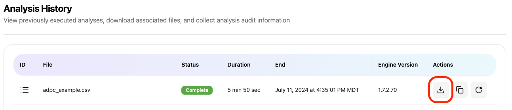

# Downloading Results
Results of a completed analysis can be downloaded by clicking the download link in the Analysis Wizard (Figure 1) or the download link from the Analysis History page (Figure 2). This will initate a download of the results of the analysis in a zip archive file. That file can be unzipped on your local computer to review the results.

**Figure 1: Example from Analysis Wizard**
\
\
\

**Figure 2: Example from Analysis History Page**
