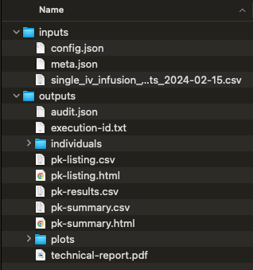

# 📂 What you get
The results zip file will include two folders: 

## Input folder
The inputs folder will include:
-   analysis dataset
-   configuration json file (`config.json`)
-   meta data json file (`meta.json`)

## Outputs folder
The outputs folder will contain:
-   audit of analysis (`audit.json`) (This file can be sent to support when you encounter an issue)
-   text file (`execution-id.txt`) with unique analysis identifier 
-   `individuals` folder
    *   Separate files for each individual profile. This file includes all PK parameters for the subject for all estimated kel values
-   Individual PK parameters: csv (`pk-listing.csv`) and html (`pk-listing.html`)
    *   This file includes the PK parameters for all subjects using the kel rules to determine the best-fit kel value for each subject
-   Complete PK parameter results in csv (`pk-results.csv`)
    *   This file includes the PK parameters for all subject and includes all estimated kel values for each subject
-   Summary of PK parameters: csv (`pk-summary.csv`) and html (`pk-summary.html`)
-   `plots` folder
    *   Individual plots in linear, semi-log, and semi-log with best-fit kel
    *   Summary plots in linear and semi-log
-   Technical report (`technical-report.pdf`)

