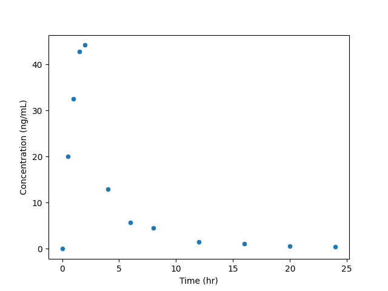
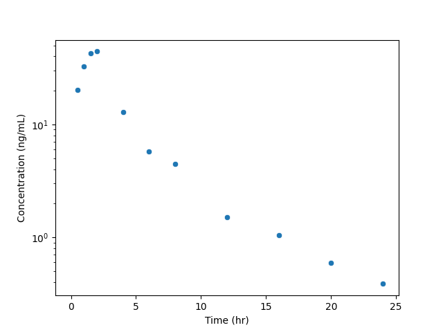
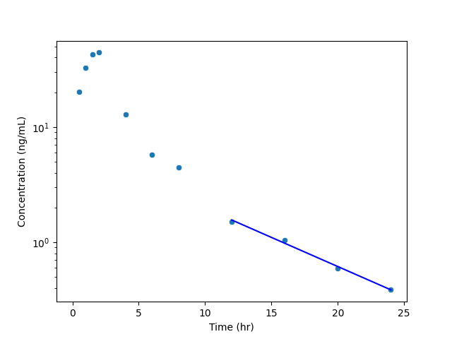

# Individual Plots
Three separate individual concentration-time plots are produced for each unique profile in the dataset. All plots are saved in the "plots" folder of the output. These three plots are described below.

## Linear Plot
This is a plot of the analyzed concentration-time data with a linear y-axis.

## Semilog Plot
This is a plot of the analyzed concentration-time data with a logarithmic y-axis.

## Thalf Plot
This is a plot of the analyzed concentration-time data with a logarithmic y-axis, and a line with the best fit terminal slope regression. The best-fit regression only covers that time range used for estimation of the slope.

