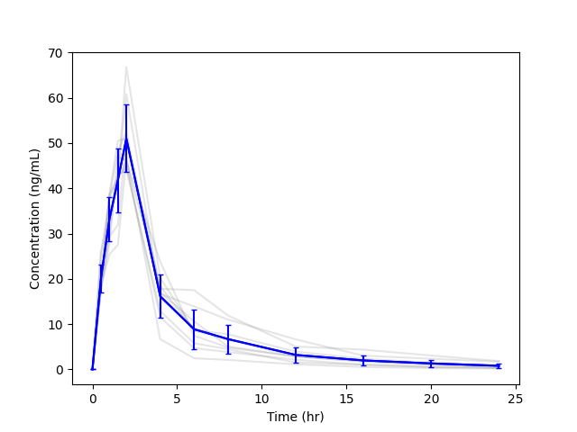
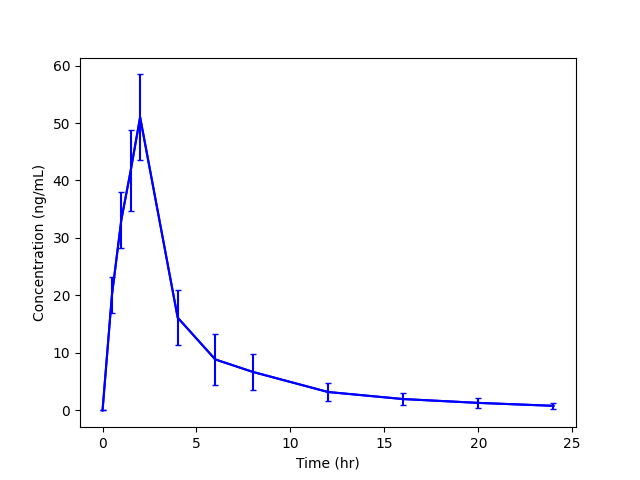
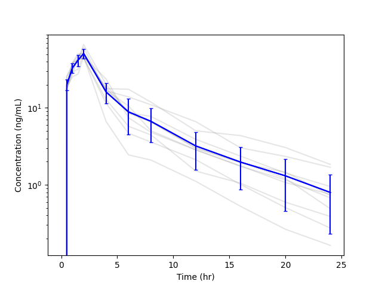
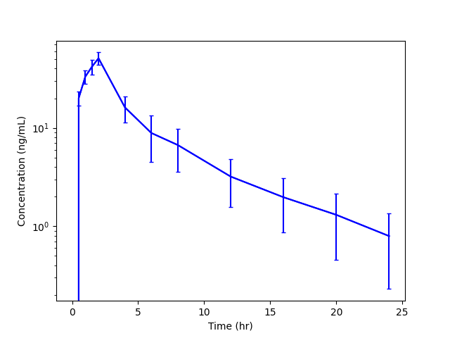

# Summary Plots
A summary plot is produced with a linear y-axis and a logarithmic y-axis. The summary plot includes the mean and standard deviation of the concentration at each time point. The mean and standard deviation are plotted in blue color and the individual subject profiles are plotted in a light grey color.

As with the [Summary PK Parameters](./results-summary), if grouping variable(s) are included in the analysis, multiple summary plots are produced. Please see the [Summary PK Parameters](./results-summary) page for a description of the summaries that are produced. For each summary group, there will be 2 summary plots: one with a linear y-axis and one with a logarithmic y-axis.

## Linear Summary Plot with Individuals

## Linear Summary Plot without Individuals

## Semilog Summary Plot with Individuals

## Semilog Summary Plot without Individuals

