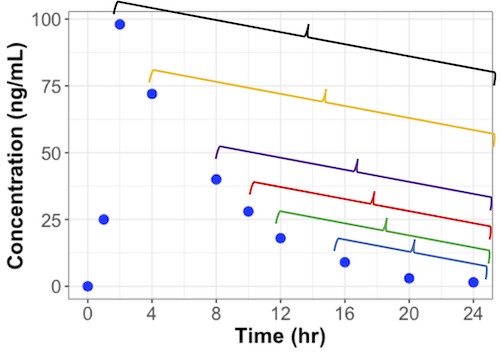
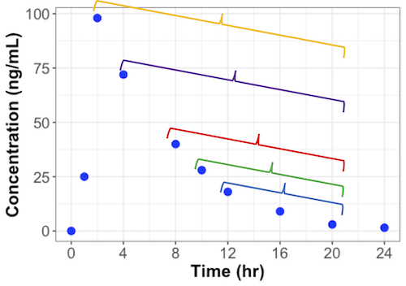

# Terminal Slope

Terminal slope values are calculated using simple linear regression with the x-values being the time variable and y-values being the natural log of the analyzed concentration variable. The estimated terminal slope value is used in the calculation of many pharmacokinetic parameters; however, there is no standard for the choice of which data points should be included in the calculation of the terminal slope value. 

Other software packages require the user to individually select data points to be included in the terminal slope calculation. Or the user must provide algorithm settings to define a "best" set of data points for the calculation of the terminal slope. And then a single terminal slope parameter is calculated. 

The Aplos NCA takes a different approach and calculates multiple terminal slope values for each unique profile. Based on the algorithm settings to define the "best" terminal slope estimate, a single terminal slope for each unique profile is included in data summaries; however, all terminal slope values and all pharmacokinetic paramaters associated with each terminal slope value are returned to the user should they want to explore alternate values for terminal slope.

## How Many Terminal Slopes are Calculated?

The number of terminal slope values is determined using the concentration values from Clast to Cmax (or C0 for IV bolus administration). Assuming that the number of samples, including Clast and Cmax (or C0) are represented by $n$, the number of terminal slopes calculated is determined by the following equation:

\# of groups = $(n-2) + (n-3)$

The value $(n-2)$ represents the number of terminal slope calculations that can be done starting with the last 3 data points, the last 4 data points, the last 5 data poitns, and so on until you reach the last $n$ data points. The following figure illustrates the data points included in each of the 6 groups for this profile.

The value $(n-3)$ represents the number of terminal slope values that can be calculated if you exclude Clast and take the remaining 3 data points, the remaining 4 data points, the remaining 5 data points, and so on until you reach the remaining $n-1$ data points. The following figure illustrates the data points included in each of the 5 groups for the same profile as shown above.

In the example plots above, there are 8 data points from Cmax to Clast. There will be 11 terminal slope calculations performed for this one profile. For each of those 11 terminal slope calculations, all associated pharmacokinetic parameters (e.g. AUC infinity) will be calculated. 

# Selection of Best Terminal Slope

Although multiple terminal slope values are calculated for each unique profile, a single terminal slope value is considered the best option based on criteria supplied by the user. The criteria are followed in sequential order until there is either a single terminal slope value reported for each unique profile. It is possible that none of the terminal slopes will meet all of the required criteria and thus no terminal slope will be reported for that unique profile. If a terminal slope value is not reported for a profile, none of the parameters that depends on the terminal slope will be reported for that unique profile. 

Using the criteria listed below, the "best" terminal slope value is reported for each unique profile in data listings and summaries. All other terminal slope values are reported in the raw results for each unique profile.

| Position | Rule | Default | Options |
| :---: | :--- | :--- | :--- |
| 1 | Regression statistic used | Adjusted r2 | r2 |
| 2 | Minimum statistic value | 0 (not used) | Any value >0 and <1. |
| 3 | Maximum extrapolation for AUC infinity linear | 0 (not used) | Any value between 0 and 100. |
| 4 | Maximum extrapolation for AUC infinity linlog | 0 (not used) | Any value between 0 and 100. |
| 5 | Maximum span | 0 (not used) | Any value &#8805;0. |
| 6 | Maximum number of points | 0 (not used) | Any value &#8805;0. |
| 7 | Earliest time value | 0 (not used) | Any value >0 |
| 8 | Tie-breaker 1 | Fewest number of data points | Not applicable |
| 9 | Tie-breaker 2 | Latest time value for the first point used in the calculation | Not appliable |

