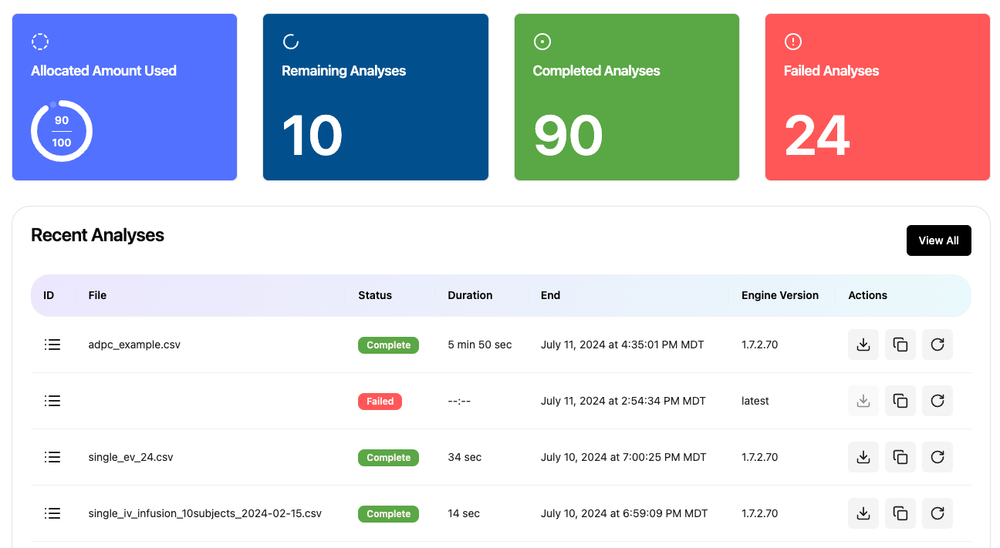

# 📊 Dashboard
The dashboard page appears after login to the Aplos web interface. This page includes details about the number of successful analyses, failed analyses, and the progress toward the analysis limit in your subscription. It also includes quick links to the most recent analyses completed.

## Allocated Amount Used
The top left of the Dashboard shows the number of completed analyses relative to the total number of analyses available as part of your subscription. Only <button style="background-color: #5AA745; color: #fff1f2; border-radius: 12px; padding: 2.5px 10px;" name="button">Complete</button> analyses are counted against the allocation. Analyses with a status of <button style="background-color: #ff5757; color: #fff1f2; border-radius: 12px; padding: 2.5px 10px;" name="button">Failed</button> are not counted against the allocation. Any analyses that are currently in process are against the allocated amount used, and removed from that calculation if a failure occurs.

## Remaining Analyses
This is the number of analyses remaining for the subscription period.

## Completed Analyses
This is the number of <button style="background-color: #5AA745; color: #fff1f2; border-radius: 12px; padding: 2.5px 10px;" name="button">Complete</button> analyses for this user.

## Failed Analyses
This is the number of <button style="background-color: #ff5757; color: #fff1f2; border-radius: 12px; padding: 2.5px 10px;" name="button">Failed</button> analyses for this user.

## Recent Analysis
Below the presentation of <button style="background-color: #5AA745; color: #fff1f2; border-radius: 12px; padding: 2.5px 10px;" name="button">Complete</button> and <button style="background-color: #ff5757; color: #fff1f2; border-radius: 12px; padding: 2.5px 10px;" name="button">Failed</button> analyses is a list of the five most recent analyses where you can directly download the results by clicking the download button.

