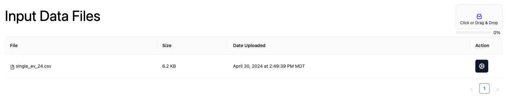

# Input Data 
The input (or analysis) data screen is where users can upload a new dataset or prepare a configuration and execute an analysis.

## Upload a new dataset
You can upload a new dataset by clicking the link in the top right corner of the screen to get a file browser, or you can simply drag and drop a file on the area in the top right corner. After the file uploads, the Input Data Files page will refresh in 3-5 seconds and the newly uploaded file will appear.

## Prepare configuration and execute analysis
You can set the configuration for a dataset by clicking the Action icon on the right side of the screen for a specific dataset. This will bring up the configuration page, which is described [here](./config-dosing.md).

## Unique File Identifier
There is a small icon to the left of the filename that includes the unique file identifier. Clicking that icon will copy that unique file identifier to the clipboard for the user. This identifier can be used to initiate an analysis using a scripting language (like [R](/docs/samples/r-overview.md), [SAS](/docs/samples/sas-overview.md), or [Python](/docs/samples/python-overview.md)).

