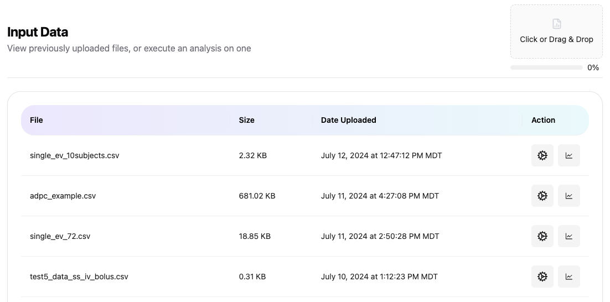

# 📝 Input Data 
The input (or analysis) data screen is where users can upload a new dataset or prepare a configuration and execute an analysis.

## Upload a new dataset
You can upload a new dataset by clicking the link in the top right corner of the screen to get a file browser, or you can simply drag and drop a file on the area in the top right corner. After the file uploads, the Input Data Files page will refresh in a few seconds and the newly uploaded file will appear. If you upload a non-CSV file, that file will be converted to CSV format before the file will appear in the input data list.

## Prepare configuration and execute analysis
You can set the configuration for a dataset by clicking the gear icon under the Action column for a specific dataset. This will bring up the configuration page, which is described [here](./config-dosing.md).

## Explore data
You can explore the input data using our interactive plotting tool by clicking the chart icon under the Action column for a specific dataset. This will bring up the Data Explorer window, which is described [here](./web-dataexplorer.md).

## Unique File Identifier
Clicking the filename will copy that unique file identifier to the clipboard for the user. This identifier can be used to initiate an analysis using a scripting language (like [R](/docs/samples/r-overview.md), [SAS](/docs/samples/sas-overview.md), or [Python](/docs/samples/python-overview.md)).

