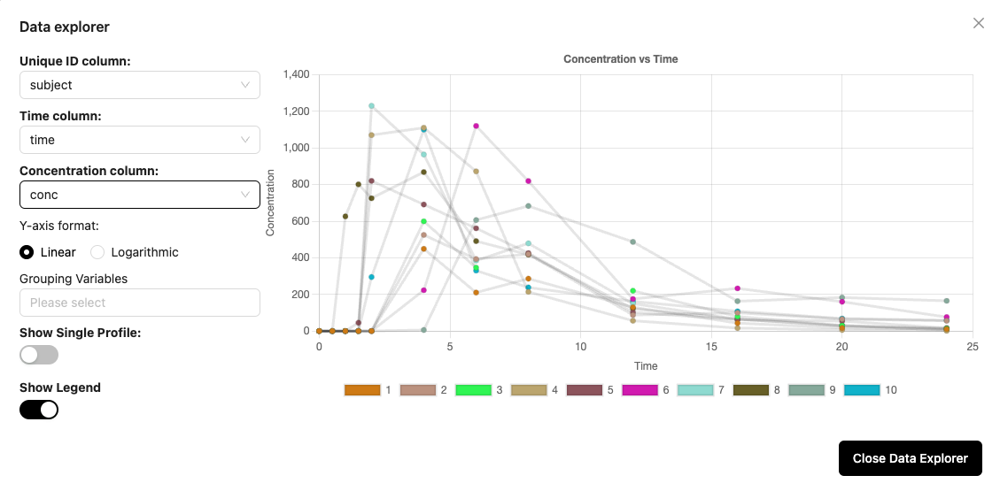

# 📉 Data Explorer
The Data Explorer allows you to view your data before analysis. You can select the columns for unique id, time, concentration, and grouping variables and view the resulting profiles. You can view the data individually or on combined. Use this tool to ensure that you have the correct columns selected for your analysis.

## Column selection
You can select columns for the Unique ID, Time, and Concentration using the dropdown list generated from the column headers in your dataset. You can select columns for grouping variables if needed also. Multiple columns can be selected as grouping variables. 

## Single profile
The default setting is to show all profiles on a single plot; however, if you want to examine individual profiles, you can turn on the Show Single Profile option and then you will be able to advance through each unique profile. 

## Legend
The legend is interactive, and you can click on a legend item to show or hide that profile. Any profile can be hidden by clicking the name in the legend. That will change the text to ~~strikethrough~~ and the data will be hidden in the plot. If you click the ~~strikethrough~~ text, the profile will appear again on the plot. 

##
> [!TIP]
> Use the Data Explorer to check that your input columns will provide the correct groupings to get unique profiles. You can then take your column settings and enter them in a configuration window to execute your analysis.

##

<iframe src="https://guides.aplosanalytics.com/embed/clyj3qs3i09wsphh0w1ffad51" loading="lazy" title="Data Explorer" allow="clipboard-write" frameborder="0" webkitallowfullscreen="true" mozallowfullscreen="true" allowfullscreen style="position: absolute; top: 0; left: 0; width: 100%; height: 100%;"></iframe>

