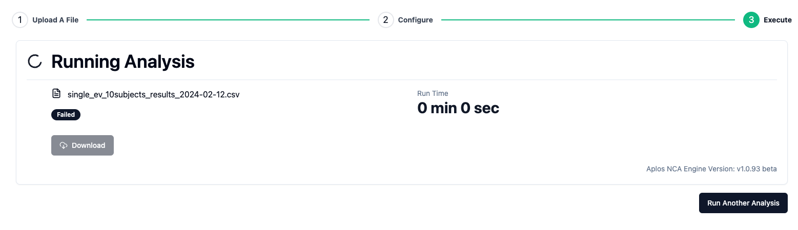

# Analysis History
The analysis history page gives a chronological listing of all analyses for the user. This includes completed analyses, failed analyses, and ongoing analyses. Users can download results of any completed analysis from this screen.

## Downloading results
The results package can be downloaded by clicking the download link on the right side of the row for each analysis.

## Unique Analysis Identifier
The ID column includes the Unique Analysis Identifier. Clicking the icon in that column will copy that identifier to the clipboard.

## Unique File Identifier
The File column includes an icon with the Unique File Identifier. Clicking on the icon in that column will copy that identifier to the clipboard.

## Copying Audit Trail
While the key details of the analysis for audit purposes are included in the technical report, a user can copy those details to the clipboard by clicking teh Audit button at the far right side of the row for each analysis. This audit information includes the following: 
-   Unique analysis identifier
-   User email address
-   User name
-   User company name
-   Date of analysis initiation (using UTC)
-   Start time of analysis (using UTC)
-   Version of the Aplos NCA calculation engine
-   Analysis type
-   Version of the API
-   Analysis duration
-   Analysis input file
-   Unique file identifier for analysis input file
