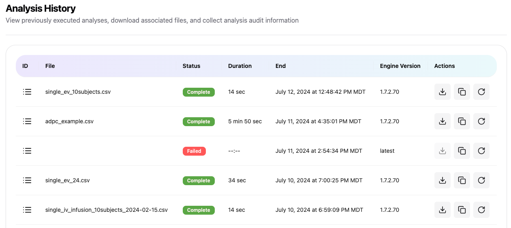

# 🏁 Analysis History
The analysis history page gives a chronological listing of all analyses for the user. This includes completed analyses, failed analyses, and ongoing analyses. Users can download results of any completed analysis from this screen.

## Unique Analysis Identifier
The ID column includes the Unique Analysis Identifier. Clicking the icon in the ID column to copy that identifier to the clipboard.

## Unique File Identifier
The Unique File Identifier is for the input file for the analysis. Clicking on the filename in the File column will copy that identifier to the clipboard.

## Downloading results
The results package can be downloaded by clicking the download link under the Action column for each analysis. A download icon will only be shown for completed analyses.

## Copying Audit Trail
While the key details of the analysis for audit purposes are included in the technical report, a user can copy those details to the clipboard by clicking the copy icon under the Action column for each analysis. This audit information includes the following: 
-   Unique analysis identifier
-   User email address
-   User name
-   User company name
-   Date of analysis initiation (using UTC)
-   Start time of analysis (using UTC)
-   Version of the Aplos NCA calculation engine
-   Analysis type
-   Version of the API
-   Analysis duration
-   Analysis input file
-   Unique file identifier for analysis input file

## Load Previous Analysis
There are occassions where you may want to re-run an analysis with a few changes. The redo icon under the Action column for each analysis will reload the configuration screen with the previous settings. You can then make changes to the analysis (e.g. add a grouping column, or add meta data) and execute the new analysis. The new analysis results will then appear in the Analysis History page. This action does not modify or change the original analysis in any way.