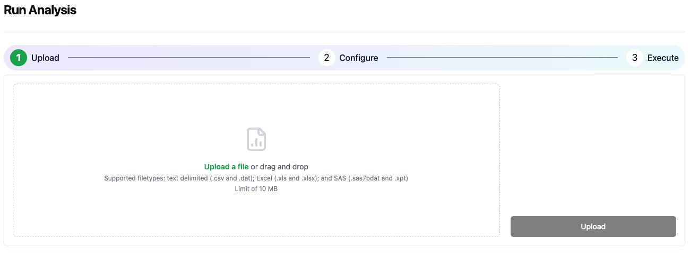
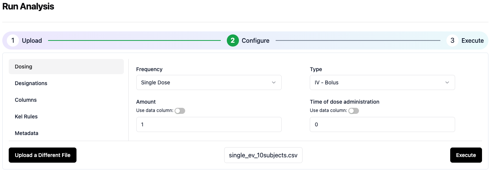
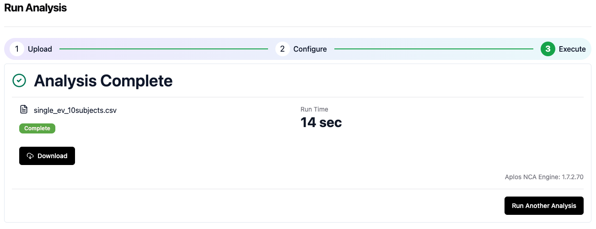

# Run Analysis Wizard
The run analysis wizard assists the user to perform an analysis using guided instructions.

## Step 1: Upload a file

To upload an input file for analysis, drop the file on the left side of the screen, or click the link to open a file browser and select the file for upload. Then click the Upload button in the lower right to transfer the file to the Aplos NCA user storage location.

## Step 2: Configure analysis and execute

After the upload completes, you will be moved to the Configuration screen. Enter the information about the dataset in the fileds and drop-down selectors. Details on each section of the configuration are described [here](./config-dosing.md). When you are ready to initiate the analysis, click the Execute button in the lower right.

## Step 3: Download results when analysis is completed

After you initate the execution, you will be moved to the analysis progress screen that will update every 5 seconds with the progress. When the analysis is complete, you will be able to download the results with the link on the screen. You can also start another analysis by clicking the Run Another Analysis in the lower right corner.

