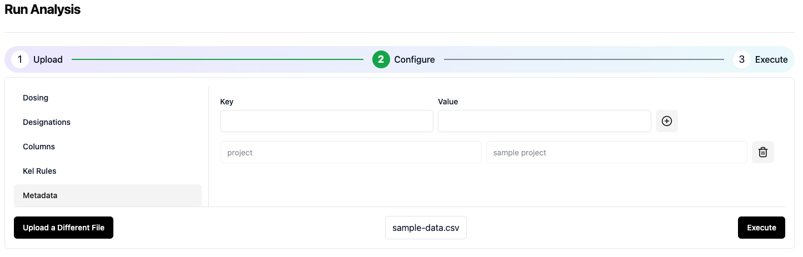

# 2️⃣ Configure Analysis Settings
The configuration screen includes 5 separate sections. The first 3 sections require information about the analysis dataset. The last 2 sections are optional.

## 1. Dosing
Enter information about the dose administration in this section as shown in the image below. 


## 3. Designations
Enter the information about the text designations for BLQ and missing samples and the units for concentration, dose, and time as shown in the image below.


## 4. Data Columns
Select the column names from the sample dataset associated with each of the fields shown in the image below. 


## 5. Kel Rules
The Kel rules are the criteria used to select the "best-fit" terminal elimination rate constant. In this example, we will use the maximum adjusted r<sup>2</sup> as the only criterion. Enter the information as shown in the image below.


## 6. Meta Data
Meta data is information that will be associated with the analysis within the Aplos NCA system. Enter the following key:value pairs as shown below.
```json
"project":"Quick start",
"compound":"AZ-123",
"study":"CL-123-001"
```


## 7. Execute the analysis
Now click the Execute button in the lower right corner to initate the analysis.
