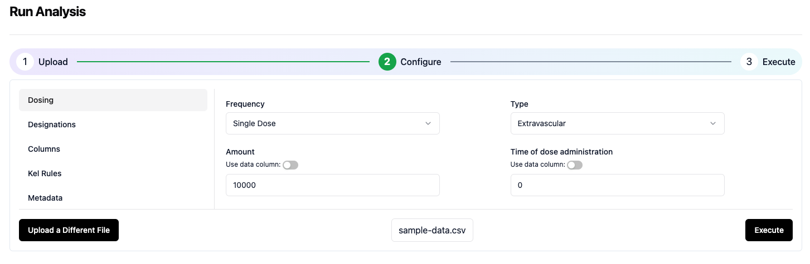
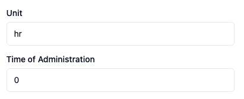
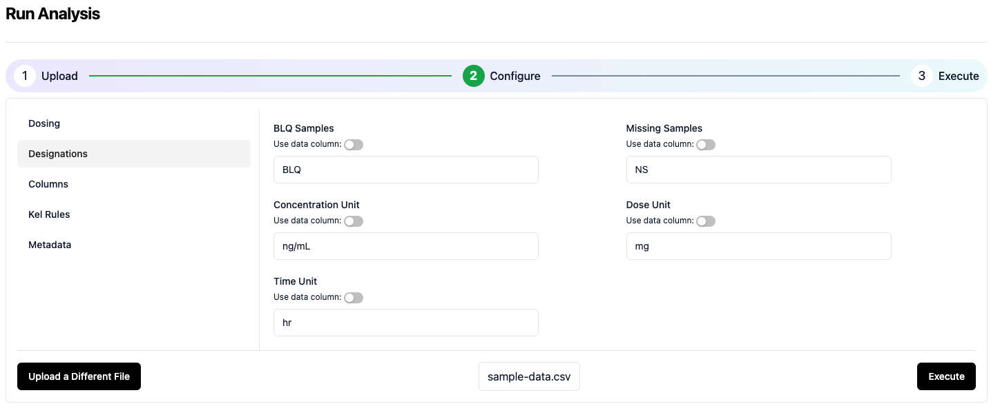
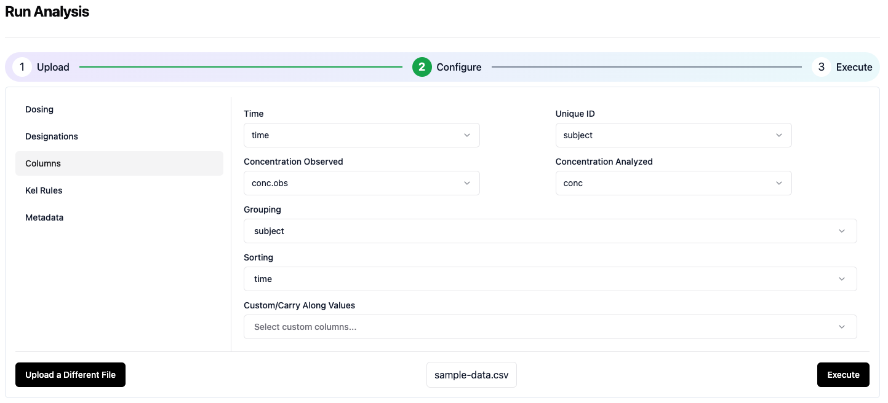
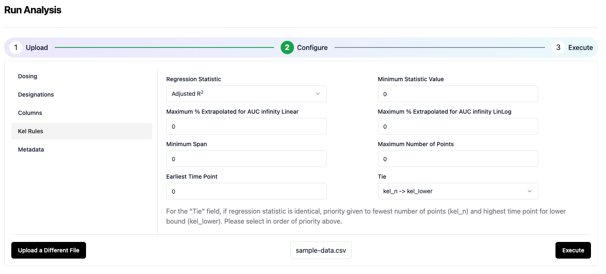
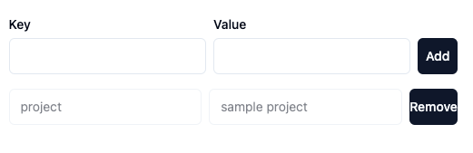

# Configure Analysis Settings
The configuration screen includes 6 separate sections. The first 4 sections require information about the analysis dataset. The last 2 sections are optional.

## Dosing
Enter information about the dose administration in this section. 

The following table includes an explanation of each entry item and the value required for the sample dataset. 

|Field name|Input|
|:---|:---|
|Frequency|Single Dose|
|Type|Extravascular|
|Amount|10000|
|Unit|mg|

## Time
Enter the time unit (hr) and the time of dose administration (0 hr) as shown below. 


## Designations
Enter the information about the units, and text designations for BLQ and missing samples as shown in the image below.


## Data Columns
Enter the column names from the sample dataset associated with each of the fields shown in the image below. 


## Kel Rules
The Kel rules are the criteria used to select the "best-fit" terminal elimination rate constant. In this example, we will use the maximum adjusted r<sup>2</sup> as the only criterion. Enter the information as shown in the image below.


## Meta Data
Meta data is information that will be associated with the analysis within the Aplos NCA system. Enter the following key:value pairs as shown below.
```json
"project":"Quick start",
"compound":"AZ-123",
"study":"CL-123-001"
```


## Execute the analysis
Now click the Execute button to initate the analysis.
