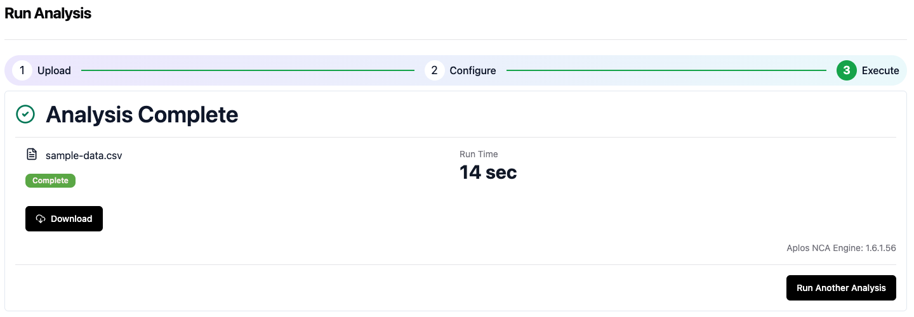
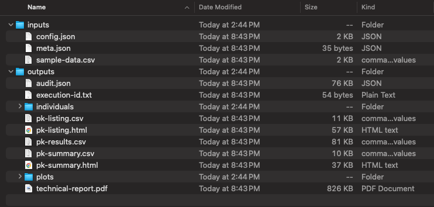

# Results
After the analysis finishes, you should see a download icon in the Analysis Wizard page like shown below:

## Download the results
Click the download button and a zip file will be securely downloaded to your computer. After the download completed, unzip the file.

## Review the results
The results will include two folders: 

The inputs folder will include:
-   analysis dataset
-   configuration json file
-   meta data json file

The outputs folder will contain:
-   audit of analysis json file (for support issues)
-   text file (execution-id.txt) with unique analysis identifier
-   Individuals folder
    *   Separate files for each individual profile. This file includes all PK parameters for the subject for all estimated kel values
-   Individual PK parameters: csv (pk-listing.csv) and html (pk-listing.html)
    *   This file includes the PK parameters for all subjects using the kel rules to determine the best-fit kel value for each subject
-   Complete PK parameter results in csv (pk-results.csv)
    *   This file includes the PK parameters for all subject and includes all estimated kel values for each subject
-   Summary of PK parameters: csv (pk-summary.csv) and html (pk-summary.html)
-   Folder with plots
    *   Individual plots in linear, semi-log, and semi-log with best-fit kel
    *   Summary plots in linear and semi-log
-   Technical report (technical-report.pdf)

