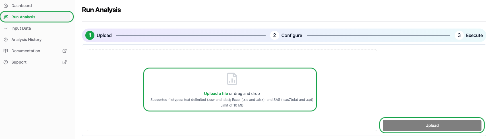

# 1️⃣ Upload analysis dataset

## 1. Analysis Wizard
After you login to the Aplos NCA web interface, click on the Run Analysis link on the left side of the screen to start the Analysis Wizard.

## 2. Upload sample dataset

You can upload the sample dataset by doing one of the following:
1. Drag and drop sample-data.csv to the upload area
2. Click on upload area and navigate to the file and click OK
3. Click the Upload button to initiate the upload of the file.

Wait for the upload to complete and then proceed to the next step.
