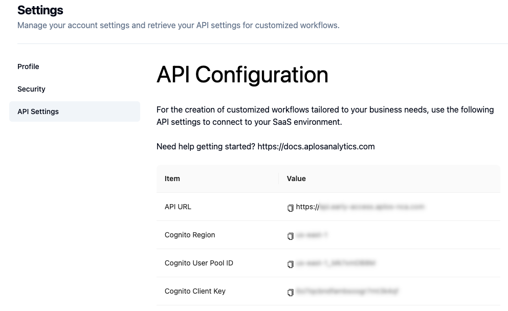

# 1️⃣ Analysis with R

You can use R to perform analysis with Aplos NCA using API calls via secure http requests. Aplos has published an R package on CRAN [aplosNCA](https://cran.r-project.org/web/packages/AplosNCA/index.html) that includes all of the functions you need to run analyses. Issues can be reported on the [github repository](https://github.com/AplosAnalytics/AplosNCA/issues). If you use your email and a password to access Aplos NCA we recommend that you save your authentication information in a hidden file on your computer rather than including it in your R scripts. If you use single sign on (SSO), we recommend that you save a current JWT in a hidden file rather than putting it in your R scripts.   

| Description | File | Link to file |
| :--- | :--- | :---: |
| Security file | security.txt | [:page_facing_up:](https://github.com/AplosAnalytics/docs.aplosanalytics.com/blob/main/docs/downloads/r-files/security.txt)|
| JWT file | jwt.txt | [:page_facing_up:](https://github.com/AplosAnalytics/docs.aplosanalytics.com/blob/e4735519c4b29399b82e236f0a7fda68b9f9f9aa/docs/downloads/r-files/jwt.txt)|

## Functions

A complete list of functions can be found with the [R package](https://cran.r-project.org/web/packages/AplosNCA/refman/AplosNCA.html). A brief description of each can be found below:

| Function | Description |
| :--- | :--- |
| aplos_get_jwt | Request authentication JSON Web Token (jwt) from Amazon Cognito. This token is required for all API calls. This uses your username and password. If you are using SSO, you will not use this function to get a jwt. |
| aplos_get_upload_url | Request Aplos NCA for secure URL to upload input data file. |
| aplos_upload_file | Upload file to Aplos NCA |
| aplos_execute_analysis | Initiate analysis workflow |
| aplos_execution_status | Request status of previously initiated analysis workflow (including completed analyses) |
| aplos_download_results | Get secure URL to download results of previously completed analysis |
| aplos_fetch_results | Download results from previously completed analysis |


## Security file for login

Security information should never be stored within a script that is shared with other users. One method to simplify use of security information within R is to create a text file with the security information that is then imported into the script and used. Let others know that they will need to use their own security information file when using the code. The security.txt file [:page_facing_up:](https://github.com/AplosAnalytics/docs.aplosanalytics.com/blob/67243d28a2a2621fdc975b20ac3d36d788893962/docs/downloads/r-files/security.txt) shows the format, but contains no information.

The information for everything except the username and password can be obtained from the Aplos NCA Web Interface under the [Profile | API Configuration]. 


Enter the information from your account inside the quotation marks and then save the file on your computer to be imported into the R script. 

```r:line-numbers
# Example of what is in security file
COGNITO_CLIENT_ID="<value here>"
COGNITO_USER_NAME="<value here>"
COGNITO_PASSWORD="<value here>"
COGNITO_REGION="<value here>"
APLOS_API_URL="<value here>"

# Example code to read security file and assign values to variables
source(".env")
username = COGNITO_USER_NAME
password = COGNITO_PASSWORD
client_id = COGNITO_CLIENT_ID
region = COGNITO_REGION
api_url = APLOS_API_URL

```

## JWT for login

Users that login with SSO cannot generate a JSON web token by requesting it with a username and password. Users should instead copy the current token from the web browser by following the instructions below. 
<div style="position: relative; box-sizing: content-box; max-height: 80vh; max-height: 80svh; width: 100%; aspect-ratio: 1.78; padding: 40px 0 40px 0;">
  <iframe src="https://guides.aplosanalytics.com/embed/cmtm4ivaw0715qmh5nwtqfg0i?embed_v=2&utm_source=embed" loading="lazy" title="Copy Security Token" allow="clipboard-write" frameborder="0" webkitallowfullscreen="true" mozallowfullscreen="true" allowfullscreen style="position: absolute; top: 0; left: 0; width: 100%; height: 100%;"></iframe>
</div>

That text should be saved in a file and then imported into the script and used directly as the authentication token. Note that JWTs are only valid for 1 hour. Because every request requires authentication, you may need to refresh your token from the web browser if you spend more than an hour working on your R code. 

Enter the information from your account inside the quotation marks and then save the file on your computer to be imported into your R script. 

```r:line-numbers
# Example of what is in jwt file
JWT="<value here>"
APLOS_API_URL="<value here>"

# Example code to read security file and assign values to variables
source("jwt.txt")
token = JWT
api_url = APLOS_API_URL
```


