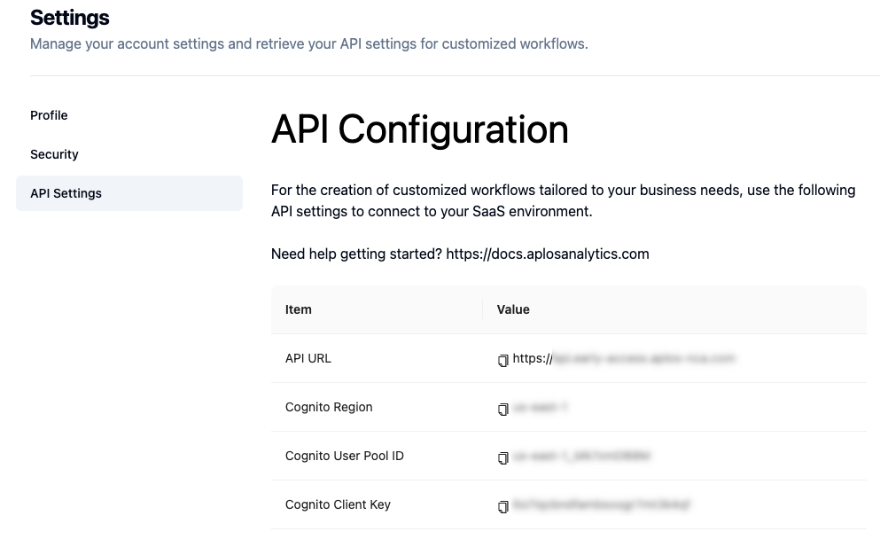

# 3️⃣ R Example Script

The example R script performs a complete analysis with Aplos NCA from R. 

## Example Script

The following line numbers include key information that must be updated in the script on the user's system. Those line numbers are also highlighted in the code below.

-   Line 11: include the name and location of the file with the security information. Including security login information directly in a script (e.g. Lines 12-16) is not recommended. The structure of the [security file](#security-information) can be found below the example R script.
-   Line 20: include the name and location of the file with the input data
-   Line 21: include the name and location of the configuration json file
-   Line 22: include the name and location of the meta data json file
-   Line 30: This is the function that will initiate the analysis using Aplos NCA. `output` is the folder where the results zip file will be downloaded, and `unzip` can be set to `TRUE` to unzip the file or `FALSE` to not unzip the file.

```r:line-numbers {11,20,21,22,60}
# Clear all objects
rm(list = ls())

# change to TRUE to unzip the output file
unzip = FALSE 

# import functions needed to run API
source("functions-api.R")

# Grab login variables from security file
source("security.txt")
username = COGNITO_USER_NAME
password = COGNITO_PASSWORD
client_id = COGNITO_CLIENT_ID
region = COGNITO_REGION
api_url = APLOS_API_URL

# here are some default file and config setups
# adjust your code accordingly
input_file = "../single_ev_10.csv"
config_file = "./files/configuration_single_ev.json"
meta_file = "./files/meta_data.json"

# Record the start time for the script
start_time <- Sys.time()

cat("Log in ... \n")
jwt <- get_jwt(client_id,username,password,region)

aplos_nca(token = jwt,
          input = input_file,
          config = config_file,
          meta = meta_file,
          url = api_url,
          output = "./",
          unzip = TRUE)

# Record the end time for the script
end_time <- Sys.time()
total_time <- hms_span(start_time,end_time)
cat(paste0("Total runtime was ",total_time," (Hours:Minutes:Seconds) \n"))

```

## Security Information

Security information should never be stored within a script that is shared with other users. One method to simplify use of security information within R is to create a text file with the security information that is then imported into the script and used. Let others know that they will need to use their own security information file when using the code. The security.txt file [:page_facing_up:](https://github.com/AplosAnalytics/docs.aplosanalytics.com/blob/67243d28a2a2621fdc975b20ac3d36d788893962/docs/downloads/r-files/security.txt) shows the format, but contains no information.

The information for everything except the username and password can be obtained from the Aplos NCA Web Interface under the [Profile | API Configuration](./r-script.md#security-information). 


Enter the information from your account inside the quotation marks and then save the file on your computer to be imported into the Example R script. 

```r:line-numbers
APLOS_API_URL="<value here>"
COGNITO_CLIENT_ID="<value here>"
COGNITO_USER_NAME="<value here>"
COGNITO_PASSWORD="<value here>"
COGNITO_REGION="<value here>"
```