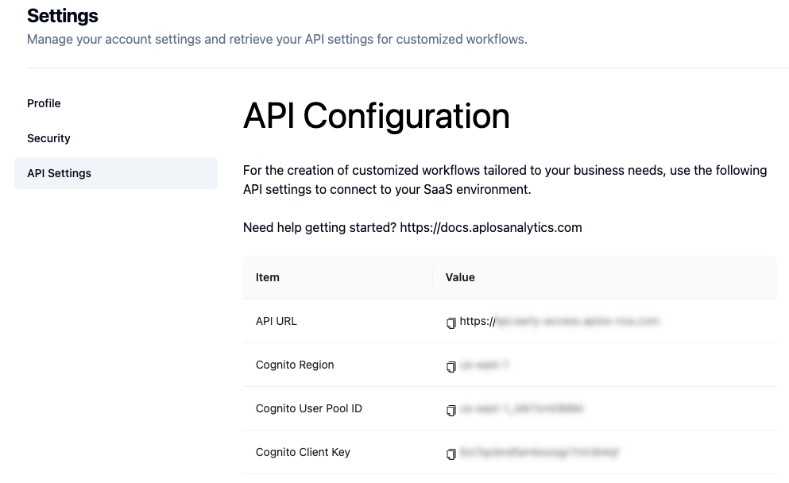

# Analysis with SAS

You can use SAS to perform analysis with Aplos NCA using API calls via secure http requests using proc http. Aplos has prepared a sample program to illustrate how this analysis can be performed using SAS. The single SAS program will upload a dataset, initiate analysis, and then download the results when complete. You can use the links below to see each file and the download it to your computer from the GitHub repository using the download link.   

| Description | File | Link to file |
| :--- | :--- | :---: |
| SAS Program | aplos_nca_sample.sas | [:page_facing_up:](https://github.com/AplosAnalytics/docs.aplosanalytics.com/blob/67243d28a2a2621fdc975b20ac3d36d788893962/docs/downloads/sas-files/aplos_nca_sample.sas)|
| Security file | sas_security.env | [:page_facing_up:](https://github.com/AplosAnalytics/docs.aplosanalytics.com/blob/67243d28a2a2621fdc975b20ac3d36d788893962/docs/downloads/sas-files/sas_security.env)|
| Sample data file | single_ev_10.csv | [:page_facing_up:](https://github.com/AplosAnalytics/docs.aplosanalytics.com/blob/67243d28a2a2621fdc975b20ac3d36d788893962/docs/downloads/sas-files/single_ev_10.csv)|
| Configuration file | configuration_single_ev.json | [:page_facing_up:](https://github.com/AplosAnalytics/docs.aplosanalytics.com/blob/67243d28a2a2621fdc975b20ac3d36d788893962/docs/downloads/sas-files/configuration_single_ev.json)|
| Meta data file | meta_data.json | [:page_facing_up:](https://github.com/AplosAnalytics/docs.aplosanalytics.com/blob/67243d28a2a2621fdc975b20ac3d36d788893962/docs/downloads/sas-files/meta_data.json)|
| Complete repository | all files | [:link:](https://github.com/AplosAnalytics/docs.aplosanalytics.com/tree/67243d28a2a2621fdc975b20ac3d36d788893962/docs/downloads/sas-files) |

## Functions

There are 6 functions provided to perform analysis with Aplos NCA. Detailed descriptions of the functions and the code are available on a separate [page](./sas-program.md). A short description can be found below:

| Function | Description |
| :--- | :--- |
| get_jwt | Request authentication JSON Web Token (jwt) from Amazon Cognito. This token is required for all API calls. |
| get_upload_url | Request Aplos NCA for secure URL to upload input data file. |
| upload_file_api | Securely upload input data file to user account. |
| execute_analysis | Initiate analysis. |
| execution_status | Request status of ongoing or completed analysis. |
| download_results | Download results of completed analysis. |

## Security information

Security information should never be stored within a script that is shared with other users. One method to simplify use of security information within SAS is to create a text file with the security information that is then imported into the script and used. Let others know that they will need to use their own security information file when using the code. The security.txt file shows the format, but contains no information.

The information for everything except the username and password can be obtained from the Aplos NCA Web Interface under the [Profile | API Configuration](./sas-overview.md#security-information). 


Enter the information from your account inside the quotation marks and then save the file on your computer to be imported into the Example sas script. 

```sas:line-numbers
APLOS_API_URL=<value>
COGNITO_CLIENT_ID=<value>
COGNITO_USER_NAME=<value>
COGNITO_PASSWORD=<value>
COGNITO_REGION=<value>
```

